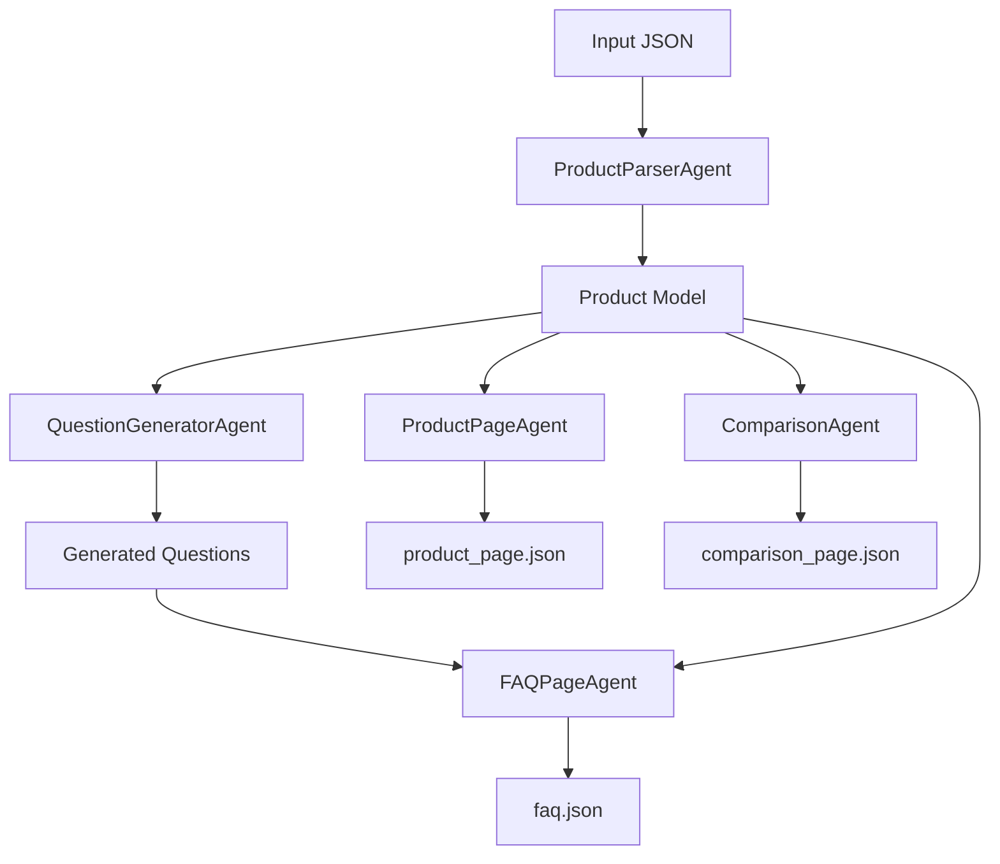

# Automated Content Generation Pipeline

## 📖 Overview
This project is an intelligent content generation system designed to automate the creation of marketing assets for e-commerce products. By leveraging Large Language Models (LLMs) through the Groq API, it transforms raw product data into comprehensive, customer-facing content including Product Pages, FAQ sections, and Competitive Analysis.

## 🏗 Design & Architecture

### Design Philosophy & Reasoning
The system was built with the following core principles:

1.  **Multi-Agent Orchestration**:
    *   **Reasoning**: Complex content generation tasks are better handled by specialized agents rather than a single monolithic prompt. This allows for better prompt engineering per task (e.g., one agent focuses purely on "tone of voice" for descriptions, another on "accuracy" for technical comparisons).
    *   **Benefit**: Modular code, easier debugging, and the ability to upgrade specific agents without breaking the entire pipeline.

2.  **Structured Data First**:
    *   **Reasoning**: LLMs can be unpredictable. By enforcing strict JSON input/output schemas and using **Pydantic models**, we ensure type safety and data integrity throughout the pipeline.
    *   **Benefit**: The output is machine-readable and ready for direct integration into frontend applications or databases.

3.  **High-Performance Inference (Groq)**:
    *   **Reasoning**: Content generation often needs to be near real-time. Groq's LPU (Language Processing Unit) architecture provides exceptionally fast inference speeds for Llama 3 models.
    *   **Benefit**: Drastically reduced latency compared to traditional GPU-based inference.

### System Architecture
The application follows a linear pipeline architecture orchestrated by a central controller.



### Key Components

*   **Orchestrator (`src/orchestrator.py`)**: The central nervous system that manages the flow of data between agents using **LangChain Runnable pipelines**. It ensures dependencies are met (e.g., Questions are generated before the FAQ Page).
*   **LLM Client (`src/llm_client.py`)**: A robust wrapper around the Groq API that handles connection details, retry logic, and enforces JSON mode for reliable outputs.
*   **Configuration (`src/config.py`)**: Centralized configuration management using Pydantic Settings (`BaseSettings`), removing scattered environment variable calls.
*   **Prompts (`src/prompts.py`)**: Centralized repository for all agent system and user prompts.
*   **Agents (`src/agents/`)**:
    *   `ProductParserAgent`: Normalizes raw input data.
    *   `QuestionGeneratorAgent`: Simulates user curiosity to generate relevant questions.
    *   `FAQPageAgent`: Synthesizes answers based on product facts.
    *   `ProductPageAgent`: Crafts persuasive marketing copy.
    *   `ComparisonAgent`: Conducts market analysis against competitors.

## 🚀 Setup & Usage

### Prerequisites
*   **Python 3.11+**
*   **Groq API Key**: You will need an active API key from Groq Console.

### Installation

1.  **Clone the repository**
    ```bash
    git clone <repository-url>
    cd Assignment
    ```

2.  **Install dependencies**
    ```bash
    pip install -r requirements.txt
    ```

3.  **Environment Configuration**
    Create a `.env` file in the root directory:
    ```env
    GROQ_API_KEY=gsk_...your_key_here...
    # Optional Configuration
    # MODEL_NAME=llama-3.3-70b-versatile
    # MODEL_TEMPERATURE=0.4
    # INPUT_PATH=input/product_input.json
    ```

### Running Tests
The project includes a comprehensive test suite using `pytest`.

```bash
pytest tests/
```

To run the **real integration test** against the live Groq API (verifying actual prompts and connectivity):

```bash
pytest tests/test_integration_real.py
```

### Running the Pipeline

1.  **Prepare Input**: Ensure `input/product_input.json` contains valid product data.
2.  **Execute**:
    ```bash
    python -m src.orchestrator
    # OR
    python main.py
    ```
3.  **View Results**: Generated JSON files will appear in the `output/` directory.

## 📂 Project Structure

```text
├── input/                  # Raw input files
├── output/                 # Generated results
├── src/
│   ├── agents/             # Task-specific LLM agents
│   ├── blocks/             # Reusable logic blocks
│   ├── config.py           # Configuration management
│   ├── llm_client.py       # Groq API wrapper
│   ├── models.py           # Pydantic models
│   ├── orchestrator.py     # Pipeline logic
│   ├── prompts.py          # Centralized prompts
│   └── schemas.py          # JSON validation schemas
├── tests/                  # Unit and integration tests
├── docs/                   # Detailed documentation
├── main.py                 # Entry point
└── requirements.txt        # Pinned dependencies
```
